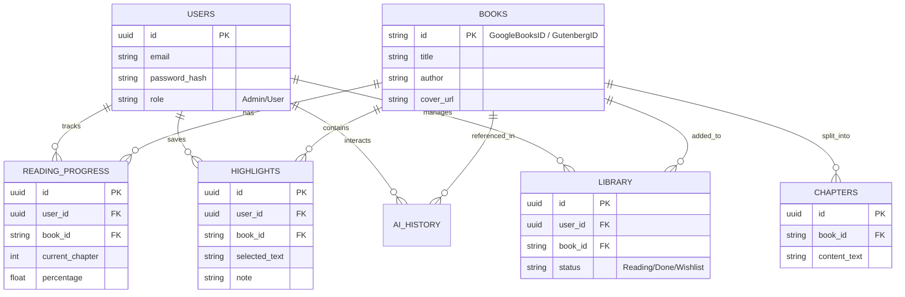

# BÁO CÁO THIẾT KẾ HỆ THỐNG SMARTBOOK – AI-POWERED BOOK READING APP

---

## I. TỔNG QUAN DỰ ÁN

* **Tên dự án:** SmartBook
* **Mô tả:** Ứng dụng đọc sách thông minh kết hợp AI giúp tối ưu hóa trải nghiệm đọc, cá nhân hóa đề xuất sách và hỗ trợ người dùng tương tác sâu với nội dung thông qua trợ lý ảo.
* **Mục tiêu:** Xây dựng hệ thống hoàn chỉnh từ Mobile, Backend REST API, Database đến tích hợp API nguồn sách mở và AI Service phục vụ đồ án phát triển phần mềm.

---

## II. KIẾN TRÚC HỆ THỐNG & CÔNG NGHỆ

### 1. Sơ đồ Triển khai Tổng thể (Deployment Diagram)

```text
[ Thiết Bị Người Dùng ]
       │
┌──────┴──────────────────────────────┐
│ Flutter App (Local Storage: SQLite) │ 
└──────┬──────────────────────────────┘
       │ HTTPS (REST API & JWT)
       ▼
┌──────────────────────────────────────────┐
│              SERVER MÁY CHỦ              │
│                                          │
│  ┌─────────────────┐      ┌───────────┐  │
│  │ FastAPI Backend │◄────►│ Redis     │  │
│  └──────┬─────┬────┘      │ (Cache)   │  │
│         │     │           └───────────┘  │
│         │     │                          │
│         │     ▼                          │
│         │  ┌──────────────────────────┐  │
│         │  │ PostgreSQL + pgvector    │  │
│         │  │ (Data & AI Embeddings)   │  │
│         │  └──────────────────────────┘  │
│         │                                │
└─────────┼────────────────────────────────┘
          │
          │ Gọi API Ngoại Vi
   ┌──────┼────────────────────┐
   ▼      ▼                    ▼
┌──────┐ ┌──────────────────┐ ┌────────────┐
│Gemini│ │ Google Books API │ │ Project    │
│API   │ │ (Metadata Sách)  │ │ Gutenberg  │
└──────┘ └──────────────────┘ └────────────┘
```

### 2. Công nghệ Chọn lựa (Technology Stack)

| Thành phần | Công nghệ / Thư viện |
| :--- | :--- | 
| **Mobile App** | Flutter + Dart | 
| **Local Storage** |SQLite (sqflite / drift) | 
| **Architecture (Mobile)** | MVVM / Clean Architecture | 
| **Backend API** | Python + FastAPI | 
| **Database & Vector DB** | PostgreSQL + pgvector | 
| **Caching** | Redis |
| **Book Metadata API** | Google Books API | 
| **Core Ebook Data** | Project Gutenberg |
| **AI Engine** | Gemini API | 
| **Authentication** | JWT (JSON Web Tokens) + RBAC |

---

## III. DỊCH VỤ DỮ LIỆU & AI (DATA & AI INTEGRATION)

### 1. Nguồn dữ liệu sách (Book Data Sources)

SmartBook sử dụng kết hợp hai nguồn dữ liệu sách với vai trò khác nhau để cân bằng giữa khả năng tìm kiếm và khả năng đọc sách.

| Nguồn | Vai trò trong SmartBook |
| :--- | :--- |
| **Google Books API** | Tìm kiếm sách và lấy metadata: tiêu đề, tác giả, mô tả, ảnh bìa, ISBN, số trang, thể loại. |
| **Project Gutenberg** | Cung cấp ebook miễn phí (EPUB, TXT) thuộc public domain để hệ thống lấy nội dung đọc trực tiếp. |

**Luồng lấy dữ liệu sách:**

```text
[ Người dùng tìm kiếm sách ]
        │
        ▼
[ Google Books API ]
        │
        ├── Trả về metadata (title, author, thumbnail, description...)
        │
        ├── Lưu metadata vào PostgreSQL/Redis Cache
        │
        ▼
[ Kiểm tra sách có bản miễn phí trên Project Gutenberg ]
        │
        ▼
[ Lấy file TXT/EPUB lưu vào Database và Chunking cho Vector DB ]
        │
        ▼
[ Reader Screen hiển thị nội dung & AI sẵn sàng tương tác ]
```

### 2. Luồng Xử lý AI Recommendation

Hệ thống kết hợp **Rule-based Hybrid** và **LLM** để tối ưu chi phí API:

```text
[ Lịch sử đọc người dùng ] 
           │
           ▼
[ Thống kê Tần suất Thể loại / Tác giả ]
           │
           ▼
[ Lấy danh sách Sách ứng viên từ Google Books API ]
           │
           ▼
[ Đưa context sở thích + danh sách sách vào Gemini API ]
           │
           ▼
[ Gemini trả về Danh sách Đề xuất + Lời giải thích cá nhân hóa ]
```

### 3. Trợ lý AI (AI Assistant & RAG System)

* **Giai đoạn Đọc (Reader Screen):** Context Toolbar hỗ trợ bôi đen chữ để Explain, Summarize, Translate, Ask AI.
* **Kiến trúc RAG (Retrieval-Augmented Generation):**
  $$\text{Book Text} \xrightarrow{\text{Chunking}} \text{Chunks} \xrightarrow{\text{Gemini Embedding}} \text{Vector DB} \xrightarrow{\text{Semantic Search}} \text{Top Chunks} \xrightarrow{\text{LLM}} \text{Answer}$$

---

## IV. USE CASE MAPPING (ÁNH XẠ CHỨC NĂNG)

| Tác nhân (Actor) | Chức năng hệ thống (Use Cases) |
| :--- | :--- |
| **User (Người dùng)** | Đăng ký/Đăng nhập, Tìm kiếm sách, Xem chi tiết, Thêm vào thư viện, Đọc sách, Lưu Highlight,Đọc sách (Online / Tải về Offline qua SQLite), Tương tác AI (Giải thích/Tóm tắt/Dịch). |
| **Admin (Quản trị)** | Đăng nhập hệ thống quản trị, Đồng bộ dữ liệu sách từ Gutenberg, Quản lý tài khoản. |
| **Google Books API** | Nhận truy vấn, Cung cấp Metadata sách. |
| **Project Gutenberg**| Cung cấp file văn bản gốc chuẩn hóa phục vụ hiển thị nội dung và AI. |
| **Gemini AI Service**| Phân tích ngữ cảnh sách, Sinh câu trả lời cho Chatbot (RAG), Trả về đề xuất sách. |

---

## V. THIẾT KẾ CƠ SỞ DỮ LIỆU (DATABASE SCHEMA)

Sơ đồ Thực thể Liên kết (ERD) thể hiện cấu trúc lưu trữ nội dung sách và tương tác người dùng:



---

## VI. CẤU TRÚC THƯ MỤC NGUỒN (PROJECT STRUCTURE)

### 1. Flutter Mobile App (`lib/`)
Tổ chức theo Clean Architecture:

```text
lib/
├── core/             # utils, constants, network, theme
├── data/             # models, datasources (Local: SQLite, Remote: API), repositories (impl)
├── domain/           # entities, repositories (interfaces)
├── presentation/     # screens: home, search, library, reader, assistant
└── main.dart
```

### 2. FastAPI Backend (`backend/`)

```text
backend/
├── app/
│   ├── main.py       
│   ├── routers/      # API endpoints (auth, books, ai)
│   ├── services/     # Logic (google_books.py, gutenberg.py, gemini_rag.py)
│   ├── models/       # SQLAlchemy/pgvector ORM models
│   ├── schemas/      # Pydantic schemas
│   └── database/     # DB Session
└── requirements.txt
```

---

## VII. DANH SÁCH MÀN HÌNH CHÍNH (UI/UX DESIGN)

| STT | Màn hình | Chức năng chính |
| :---: | :--- | :--- |
| **1** | **Login / Register** | Xác thực người dùng bằng JWT. |
| **2** | **Home Screen** | Hiển thị sách đang đọc, sách phổ biến, sách gợi ý bởi AI. |
| **3** | **Search Screen** | Tìm kiếm qua Google Books API. |
| **4** | **Book Detail** | Chi tiết sách + Lý do AI đề xuất cuốn sách này. |
| **5** | **My Library** | Quản lý tủ sách cá nhân (Đang đọc, Đã xong, Yêu thích). |
| **6** | **Reader Screen** | Đọc sách + Context Toolbar khi bôi đen chữ (Explain, Summarize, Translate). |
| **7** | **AI Assistant**| Chatbot tương tác & hỏi đáp trực tiếp về nội dung sách (RAG). |
| **8** | **Profile / Stats** | Biểu đồ thống kê thói quen đọc do AI tổng hợp. |

---

## VIII. LỘ TRÌNH TRIỂN KHAI (PHASED ROADMAP)

* **Phase 1 – Core Backend & CMS:** Thiết kế database schema, dựng FastAPI, tích hợp PostgreSQL, phân quyền JWT. Hoàn thiện luồng lấy sách tự động từ Gutenberg.
* **Phase 2 – Core Mobile:** Dựng giao diện Flutter cơ bản: Login, Home, Library và Reader Screen lấy dữ liệu văn bản từ API.
* **Phase 3 – Integration Book API:** Tích hợp Google Books API vào backend/mobile cho tính năng Search Screen và lấy Book Metadata.
* **Phase 4 – AI Assistant (RAG System):** Cấu hình `pgvector`, xây dựng luồng chunking/embedding. Tích hợp Gemini API cho AI Assistant để hỏi đáp.
* **Phase 5 – AI Recommendation & Analytics:** Hoàn thiện Engine đề xuất sách dựa trên lịch sử đọc và màn hình Profile thống kê thói quen đọc.

---

## IX. THIẾT KẾ REST API ENDPOINTS (API SPECIFICATIONS)

Hệ thống cung cấp các API RESTful được bảo mật bằng JWT, phân chia theo từng module nghiệp vụ cụ thể.

### 1. Authentication (Xác thực người dùng)
* `POST /api/auth/register` : Đăng ký tài khoản mới.
* `POST /api/auth/login` : Đăng nhập, trả về JWT Access Token và Refresh Token.
### 2. Users (Người dùng)
* `GET /api/users/me` : Lấy thông tin profile người dùng hiện tại (yêu cầu Token).

### 3. Book (Khám phá sách)
* `GET /api/books` : Lấy sách trong Database.
* `GET /api/books/search` : Tìm kiếm sách trong Database.
* `POST /api/books/{book_id}/chat` : Chat với AI về nội dung sách.
* `GET /api/books/{book_id}/chat/history` : Lấy lịch sử chat của user với cuốn sách.
* `DELETE /api/books/{book_id}/chat/history` : Xóa lịch xử của user với cuốn sách.
* `GET /api/books/{book_id}/read` : Tải nội dung chi tiết của sách để đọc.

### 4. User Library (Tủ sách cá nhân)
* `GET /api/library` : Lấy danh sách sách người dùng đã lưu (lọc theo trạng thái Reading, Done, Wishlist).
* `POST /api/library/add` : Thêm một cuốn sách vào tủ sách cá nhân.
* `PUT /api/library/{book_id}/favorite` : Thêm một cuốn sách vào mục yêu thích.
* `POST /api/library/highlights` : Lưu lại các đoạn văn bản (text) được người dùng highlight kèm ghi chú.
* `PUT /api/library/{book_id}/progress` : Cập nhật tiến độ đọc (lưu số % đã đọc của cuốn sách đó).
* `GET /api/library/{book_id}/highlights` : Xem highlights mà người dùng đã tạo.
* `DELETE /api/library/highlights/{highlight_id}` : Xóa highlights mà người dùng đã tạo.
* `DELETE /api/library/{book_id}` : Xóa sách mà người dùng đã thêm.

### 5. AI Service (Trợ lý thông minh)
* `GET /api/ai/recommendations` : Lấy danh sách sách đề xuất dựa trên lịch sử đọc (AI Recommendation).
* `POST /api/ai/quick-action` : Endpoint xử lý các tác vụ nhanh từ Context Toolbar (dịch, giải thích từ vựng, tóm tắt đoạn văn).

### 6. Admin Panel (Dành riêng cho Quản trị viên)
* `GET /api/admin/books/search/google` : Gửi yêu cầu tên sách vào API của Google Books để lấy về sách mong muốn.
* `POST /api/admin/books/import/{google_book_id}` : Import thông tin sách từ Google Book API vào Database.
* `POST /api/admin/books/{book_id}/sync-gutenberg/{gutenberg_id}` : Import nội dung sách từ Project Gutenberg vào Database dưới dạng link html.
* `POST /api/admin/books/{book_id}/process-ai` : Tách nội dung sách thành các vectơ đặc trưng phục vụ cho việc hỏi AI Assistance.
* `POST /api/admin/books/{book_id}/search-debug` : Kiểm tra và gỡ lỗi (debug) quá trình tìm kiếm ngữ nghĩa (Semantic Search) của hệ thống RAG.
* `DELETE /api/admin/books/{book_id}` : Xóa sách ra khỏi hệ thống.