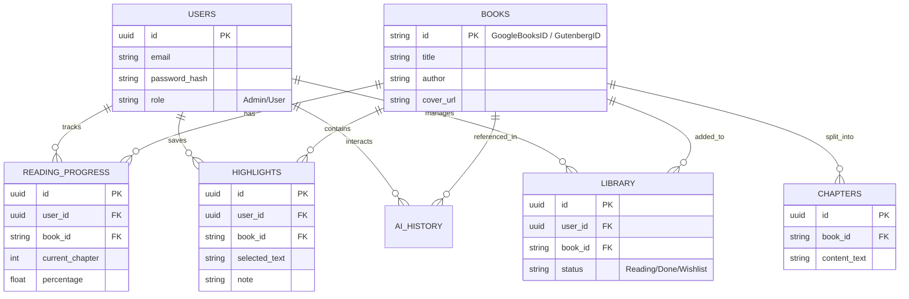

# BÁO CÁO THIẾT KẾ HỆ THỐNG SMARTBOOK – AI-POWERED BOOK READING APP

---

## I. TỔNG QUAN DỰ ÁN

* **Tên dự án:** SmartBook
* **Mô tả:** Ứng dụng đọc sách thông minh kết hợp AI giúp tối ưu hóa trải nghiệm đọc, cá nhân hóa đề xuất sách và hỗ trợ người dùng tương tác sâu với nội dung thông qua trợ lý ảo.
* **Mục tiêu:** Xây dựng hệ thống hoàn chỉnh từ Mobile, Backend REST API, Database đến tích hợp API nguồn sách mở và AI Service phục vụ đồ án phát triển phần mềm.

---

## II. KIẾN TRÚC HỆ THỐNG & CÔNG NGHỆ

### 1. Sơ đồ Triển khai Tổng thể (Deployment Diagram)

```text
[ Thiết Bị Người Dùng ]
       │
┌──────┴──────────────────────────────┐
│ Flutter App (Local Storage: SQLite) │ 
└──────┬──────────────────────────────┘
       │ HTTPS (REST API & JWT)
       ▼
┌──────────────────────────────────────────┐
│              SERVER MÁY CHỦ              │
│                                          │
│  ┌─────────────────┐      ┌───────────┐  │
│  │ FastAPI Backend │◄────►│ Upstash   │  │
│  └──────┬─────┬────┘      │Redis Cache│  │  
│         │     │           └───────────┘  │
│         │     │                          │
│         │     ▼                          │
│         │  ┌──────────────────────────┐  │
│         │  │ Supabase (Cloud DB)      │  │
│         │  │ PostgreSQL + pgvector    │  │
│         │  └──────────────────────────┘  │
│         │                                │
└─────────┼────────────────────────────────┘
          │
          │ Gọi API Ngoại Vi
   ┌──────┼────────────────────┐
   ▼      ▼                    ▼
┌──────┐ ┌──────────────────┐ ┌────────────┐
│Gemini│ │ Google Books API │ │ Project    │
│API   │ │ (Metadata Sách)  │ │ Gutenberg  │
└──────┘ └──────────────────┘ └────────────┘
```

### 2. Công nghệ Chọn lựa (Technology Stack)

| Thành phần | Công nghệ / Thư viện                                                     |
| :--- |:-------------------------------------------------------------------------| 
| **Mobile App** | Flutter + Dart                                                           | 
| **Local Storage** | SQLite (sqflite)                                                         | 
| **Architecture (Mobile)** | MVVM / Clean Architecture                                                | 
| **Backend API** | Python + FastAPI                                                         | 
| **Database & Vector DB** | Supabase (PostgreSQL + pgvector)                                         | 
| **Caching** | Upstash Redis (Serverless Cloud Cache)                                   |
| **Book Metadata API** | Google Books API                                                         | 
| **Core Ebook Data** | Project Gutenberg                                                        |
| **AI Engine** | Gemini API                                                               | 
| **Authentication** | JWT (JSON Web Tokens) + Phân quyền Admin/User                                                 |

---

## III. DỊCH VỤ DỮ LIỆU & AI (DATA & AI INTEGRATION)

### 1. Nguồn dữ liệu sách (Book Data Sources)

SmartBook sử dụng kết hợp hai nguồn dữ liệu sách với vai trò khác nhau để cân bằng giữa khả năng tìm kiếm và khả năng đọc sách.

| Nguồn | Vai trò trong SmartBook |
| :--- | :--- |
| **Google Books API** | Tìm kiếm sách và lấy metadata: tiêu đề, tác giả, mô tả, ảnh bìa, ISBN, số trang, thể loại. |
| **Project Gutenberg** | Cung cấp ebook miễn phí (EPUB, TXT) thuộc public domain để hệ thống lấy nội dung đọc trực tiếp. |

**Luồng lấy dữ liệu sách:**

```text
[ Người dùng tìm kiếm sách ]
        │
        ▼
[ Google Books API ]
        │
        ├── Trả về metadata (title, author, thumbnail, description...)
        │
        ├── Lưu metadata vào PostgreSQL/Redis Cache
        │
        ▼
[ Kiểm tra sách có bản miễn phí trên Project Gutenberg ]
        │
        ▼
[ Lấy file TXT/EPUB lưu vào Database và Chunking cho Vector DB ]
        │
        ▼
[ Reader Screen hiển thị nội dung & AI sẵn sàng tương tác ]
```

### 2. Luồng Xử lý AI Recommendation

Hệ thống kết hợp **Rule-based Hybrid** và **LLM** để tối ưu chi phí API:

```text
[ Lịch sử đọc người dùng ] 
           │
           ▼
[ Thống kê Tần suất Thể loại / Tác giả ]
           │
           ▼
[ Lấy danh sách Sách ứng viên từ Google Books API ]
           │
           ▼
[ Đưa context sở thích + danh sách sách vào Gemini API ]
           │
           ▼
[ Gemini trả về Danh sách Đề xuất + Lời giải thích cá nhân hóa ]
```

### 3. Trợ lý AI (AI Assistant & RAG System)

* **Giai đoạn Đọc (Reader Screen):** Context Toolbar hỗ trợ bôi đen chữ để Explain, Summarize, Translate, Ask AI.
* **Kiến trúc RAG (Retrieval-Augmented Generation):**
  $$\text{Book Text} \xrightarrow{\text{Chunking}} \text{Chunks} \xrightarrow{\text{Gemini Embedding}} \text{Vector DB} \xrightarrow{\text{Semantic Search}} \text{Top Chunks} \xrightarrow{\text{LLM}} \text{Answer}$$

---

## IV. USE CASE MAPPING (ÁNH XẠ CHỨC NĂNG)

| Tác nhân (Actor) | Chức năng hệ thống (Use Cases) |
| :--- | :--- |
| **User (Người dùng)** | Đăng ký/Đăng nhập, Tìm kiếm sách, Xem chi tiết, Thêm vào thư viện, Đọc sách, Lưu Highlight,Đọc sách (Online / Tải về Offline qua SQLite), Tương tác AI (Giải thích/Tóm tắt/Dịch). |
| **Admin (Quản trị)** | Đăng nhập hệ thống quản trị, Đồng bộ dữ liệu sách từ Gutenberg, Quản lý tài khoản. |
| **Google Books API** | Nhận truy vấn, Cung cấp Metadata sách. |
| **Project Gutenberg**| Cung cấp file văn bản gốc chuẩn hóa phục vụ hiển thị nội dung và AI. |
| **Gemini AI Service**| Phân tích ngữ cảnh sách, Sinh câu trả lời cho Chatbot (RAG), Trả về đề xuất sách. |

---

## V. THIẾT KẾ CƠ SỞ DỮ LIỆU (DATABASE SCHEMA)

Sơ đồ Thực thể Liên kết (ERD) thể hiện cấu trúc lưu trữ nội dung sách và tương tác người dùng:



---

## VI. CẤU TRÚC THƯ MỤC NGUỒN (PROJECT STRUCTURE)

### 1. Flutter Mobile App (`lib/`)
Tổ chức theo Clean Architecture:

```text
lib/
├── core/             # utils, constants, network, theme
├── data/             # models, datasources (Local: SQLite, Remote: API), repositories (impl)
├── domain/           # entities, repositories (interfaces)
├── presentation/     # screens: home, search, library, reader, assistant
└── main.dart
```

### 2. FastAPI Backend (`smartbook-backend/`)

```text
smartbook-backend/
├── main.py       
├── routers/     
├── ai_utils.py    
├── models.py       
├── schemas.py
├── security.py     
├── database.py       
└── requirements.txt
```

---

## VII. DANH SÁCH MÀN HÌNH CHÍNH (UI/UX DESIGN)

| STT | Màn hình | Chức năng chính |
| :---: | :--- | :--- |
| **1** | **Login / Register** | Xác thực người dùng bằng JWT. |
| **2** | **Home Screen** | Hiển thị sách đang đọc, sách phổ biến, sách gợi ý bởi AI. |
| **3** | **Search Screen** | Tìm kiếm qua Google Books API. |
| **4** | **Book Detail** | Chi tiết sách + Lý do AI đề xuất cuốn sách này. |
| **5** | **My Library** | Quản lý tủ sách cá nhân (Đang đọc, Đã xong, Yêu thích). |
| **6** | **Reader Screen** | Đọc sách + Context Toolbar khi bôi đen chữ (Explain, Summarize, Translate). |
| **7** | **AI Assistant**| Chatbot tương tác & hỏi đáp trực tiếp về nội dung sách (RAG). |
| **8** | **Profile / Stats** | Biểu đồ thống kê thói quen đọc do AI tổng hợp. |

---

## VIII. LỘ TRÌNH TRIỂN KHAI (PHASED ROADMAP)

* **Phase 1 – Core Backend & Cloud CMS:** Thiết kế database schema, dựng FastAPI, tích hợp Supabase (PostgreSQL), Upstash Redis Cache, phân quyền JWT và bảo mật `.env`. Hoàn thiện luồng import sách từ Google Books và Gutenberg.
* **Phase 2 – Core Mobile:** Dựng giao diện Flutter cơ bản: Login, Home, Library và Reader Screen.
* **Phase 3 – Integration API:** Ghép nối ứng dụng Mobile với FastAPI để gọi dữ liệu sách, đồng bộ tiến độ đọc.
* **Phase 4 – AI Assistant (RAG System):** Cấu hình `pgvector`, xây dựng luồng chunking/embedding. Tích hợp Gemini API cho AI Assistant để hỏi đáp ngay trong lúc đọc sách.
* **Phase 5 – AI Recommendation & Analytics:** Hoàn thiện Engine đề xuất sách dựa trên lịch sử đọc và màn hình Profile thống kê thói quen đọc.
---

## IX. THIẾT KẾ REST API ENDPOINTS (API SPECIFICATIONS)

Hệ thống cung cấp các API RESTful được phân chia theo từng module nghiệp vụ cụ thể. Các endpoint có yêu cầu bảo mật sẽ được bảo vệ bằng JWT.

### 1. Authentication (Xác thực người dùng)
* `POST /register` : Đăng ký tài khoản người dùng mới.
* `POST /login` : Đăng nhập vào hệ thống để nhận Access Token.

### 2. Users (Người dùng)
* `GET /users/me` : Lấy thông tin profile của người dùng hiện tại (yêu cầu Token).

### 3. Books (Khám phá sách)
* `GET /books` : Lấy danh sách sách hiện có trong hệ thống.
* `GET /books/search` : Tìm kiếm sách lưu trữ tại Local.
* `GET /books/author/{author_name}` : Lấy danh sách sách dựa theo tên tác giả.
* `POST /books/{book_id}/chat` : Trò chuyện với AI về nội dung của cuốn sách.
* `GET /books/{book_id}/chat/history` : Lấy lịch sử trò chuyện với cuốn sách.
* `DELETE /books/{book_id}/chat/history` : Xóa lịch sử trò chuyện với cuốn sách.
* `GET /books/{book_id}/read` : Mở sách để tải nội dung đọc chi tiết.
* `GET /books/{book_id}/similar` : Lấy danh sách các cuốn sách tương tự.
* `GET /books/discover/ai` : Khám phá và tìm kiếm sách thông qua AI.

### 4. User Library (Tủ sách cá nhân)
* `GET /library/` : Lấy danh sách thư viện cá nhân của người dùng.
* `POST /library/add` : Thêm một cuốn sách vào thư viện cá nhân.
* `PUT /library/{book_id}/favorite` : Bật/tắt trạng thái yêu thích cho cuốn sách.
* `POST /library/highlights` : Lưu lại các đoạn văn bản (text) được đánh dấu.
* `PUT /library/{book_id}/progress` : Cập nhật tiến độ đọc sách.
* `GET /library/{book_id}/highlights` : Lấy danh sách các đoạn highlight của một cuốn sách.
* `DELETE /library/highlights/{highlight_id}` : Xóa một đoạn highlight đã lưu.
* `DELETE /library/{book_id}` : Xóa cuốn sách khỏi thư viện cá nhân.
* `GET /library/authors` : Lấy danh sách các tác giả yêu thích.
* `POST /library/authors` : Thêm một tác giả vào danh sách yêu thích.
* `DELETE /library/authors/{author_name}` : Xóa một tác giả khỏi danh sách yêu thích.
* `GET /library/recommendations` : Lấy danh sách sách đề xuất từ AI (AI Recommendations).

### 5. AI Assistant (Trợ lý thông minh)
* `POST /ai/quick-action` : Endpoint xử lý các tác vụ nhanh từ AI (Ai Quick Action).

### 6. Admin Panel (Dành riêng cho Quản trị viên)
* `GET /admin/books/search/google` : Tìm kiếm sách trực tiếp thông qua Google Books API.
* `POST /admin/books/import/{google_book_id}` : Nhập (import) dữ liệu sách từ Google vào hệ thống.
* `POST /admin/books/{book_id}/sync-gutenberg/{gutenberg_id}` : Đồng bộ nội dung sách gốc từ Project Gutenberg.
* `POST /admin/books/{book_id}/process-ai` : Xử lý dữ liệu sách để phục vụ cho AI.
* `POST /admin/books/{book_id}/search-debug` : Kiểm tra và gỡ lỗi (debug) quá trình tìm kiếm ngữ nghĩa.
* `DELETE /admin/books/{book_id}` : Quản trị viên xóa sách khỏi hệ thống.